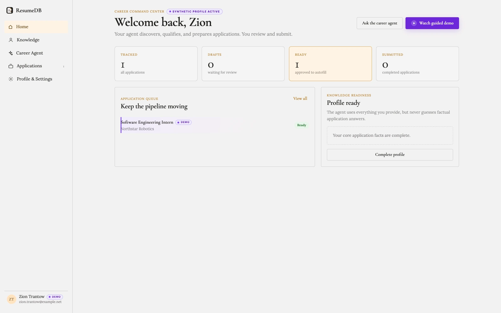
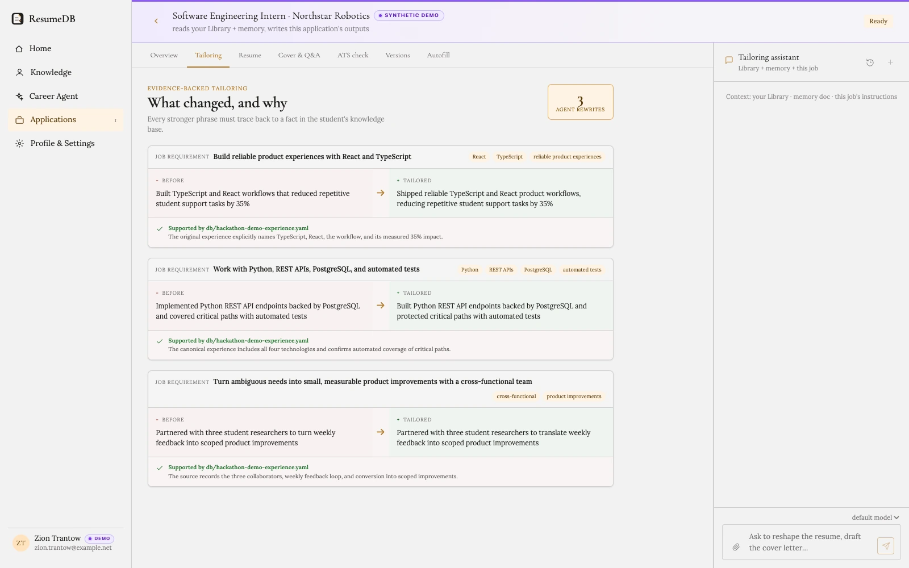
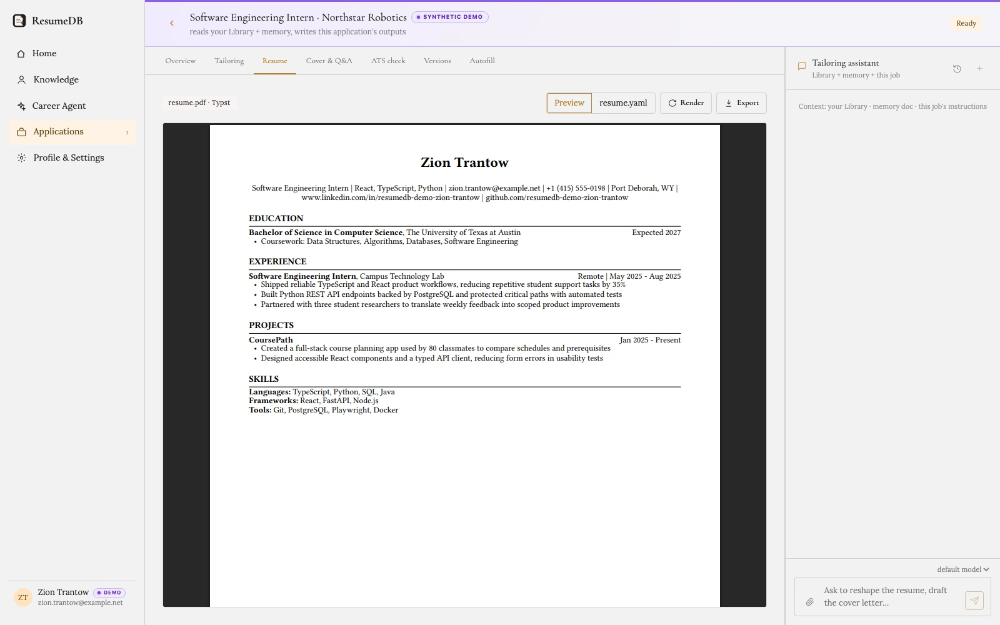
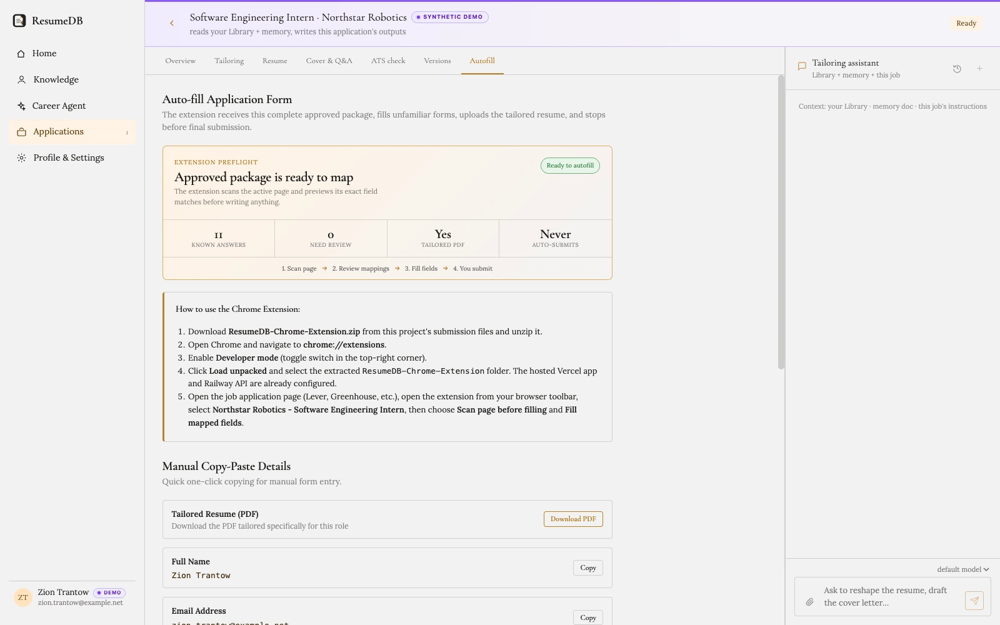

# ResumeDB

**Turn verified career evidence into tailored applications you can trust.**

ResumeDB is an agent-native internship operating system for university
students. It learns a complete, user-approved career knowledge base, discovers
qualified jobs, prepares evidence-backed application packages, and fills
application sites through a Chrome extension. The student reviews every draft
and always performs the final submission.

[Launch the hosted demo](https://resumedb-ai.vercel.app/) |
[Jump to the judge walkthrough](#judge-walkthrough) |
[Chrome extension guide](extension/README.md)



*The ResumeDB command center keeps career knowledge, applications, readiness,
and human review in one place.*

## Judge walkthrough

The fastest path requires no personal data and never sends a real application:

1. Open the [hosted demo](https://resumedb-ai.vercel.app/).
2. Select **Watch guided demo** for an animated tour of the complete workflow.
3. Open **Profile & Settings** and select **Create Ready demo + open form**.
4. Return to ResumeDB, open **Applications**, and select the purple Northstar
   Robotics demo application.
5. Explore **Tailoring**, **Resume**, **ATS check**, and **Autofill** to see the
   evidence, generated materials, readiness checks, and extension handoff.
6. Optionally load the Chrome extension and use **Scan page before filling** on
   the synthetic Northstar form. ResumeDB previews every mapping before it
   writes.

The sandbox uses clearly labeled synthetic data throughout. The final submit
button is always left to the user.

## Evidence, not invented confidence

ResumeDB does more than rewrite a resume. It shows exactly what changed, which
job requirement motivated the change, and which approved career fact supports
the stronger language.



Every important application fact follows the same rule. Identity, education,
work authorization, dates, credentials, skills, and metrics are never inferred
when the knowledge base does not contain an answer.

## How Codex and GPT-5.6 powered ResumeDB

Codex was the primary engineering environment for ResumeDB, not a last-mile
autocomplete tool. GPT-5.6 supplied the reasoning behind the work, while Codex
turned that reasoning into repository changes, working product flows, browser
verification, and a judge-ready release.


Together, Codex and GPT-5.6 helped drive the entire development loop:

- **Product and architecture:** translated the original vision into a coherent
  career knowledge base, application state machine, agent workflow, Chrome
  extension, and MCP interface.
- **Full-stack implementation:** worked across the FastAPI backend, React
  frontend, Git-backed data model, PDF rendering, extension, and deployment
  boundaries without losing the end-to-end product intent.
- **Agent safety:** made evidence provenance, deterministic readiness blockers,
  human approval, and the no-auto-submit rule part of the architecture rather
  than afterthoughts.
- **Dogfooding and visual QA:** exercised the product as a user, followed real
  browser flows, inspected screenshots, fixed rough edges, and repeatedly
  audited the shortest judge path.
- **Verification:** built and ran focused tests across ingestion, application
  preparation, agent connections, deployment behavior, and extension logic.

ResumeDB also treats Codex as a product surface. A user can create a revocable
**Bring your own agent** connection and let their own Codex session work with
the approved career context through bounded MCP tools. ResumeDB does not need
the user's OpenAI API key, and the connected agent still cannot approve or
submit an application.

For the final judge-path audit, a fresh GPT-5.6 Codex session connected to the
hosted ResumeDB MCP server, read the complete synthetic candidate context, and
found the prepared Ready application. That closed the loop: Codex helped build
the product, and ResumeDB became a useful, safety-bounded tool for Codex.

## From career knowledge to a ready application


1. **Build one durable career knowledge base.** Import a PDF resume, review
   proposed facts, and add reusable application answers once.
2. **Discover qualified roles.** Give the Career Agent a goal, a job URL, or a
   pasted posting. ResumeDB explains fit, missing facts, and hard conflicts.
3. **Prepare a complete package.** High-confidence matches can become tailored
   drafts with a resume, cover letter, application answers, recruiter message,
   provenance, and explicit tailoring decisions.
4. **Review before approval.** Deterministic blockers keep incomplete or
   unsupported drafts from becoming ready.
5. **Preview and fill.** The extension scans the active site, shows the exact
   field mappings, fills approved answers, uploads the tailored PDF, and stops
   before submission.

## The complete application workbench

Each application is its own workbench with one job, one evidence-backed package,
and an exact five-stage lifecycle: `not_started`, `in_progress`, `draft`,
`ready`, and `submitted`.



The workbench includes the job description, fit evidence, before-and-after
tailoring, a rendered PDF, cover letter, reusable and job-specific answers, ATS
coverage, version history, readiness blockers, and the extension handoff.



## What makes ResumeDB different

- **One approved source of truth:** career facts and application answers are
  learned once instead of re-entered for every job.
- **Explainable tailoring:** every material rewrite links back to approved
  evidence and the job requirement it addresses.
- **Persistent agent work:** live timelines survive refreshes and show progress
  from knowledge read through application preparation.
- **Human-controlled execution:** agents may discover, draft, tailor, and map,
  but only the user can approve or submit.
- **Browser-native handoff:** the extension works inside the user's signed-in
  browser without storing job-site passwords.
- **Inspectable history:** the career data lives in a separate local Git
  repository, so every profile and application change is recoverable.
- **Agent-native access:** the generated OpenAPI interface and revocable MCP
  connections expose the same bounded career capabilities to external agents.

## Bring your own agent

ResumeDB can create a revocable Streamable HTTP MCP connection for Codex or
another compatible client. The connection exposes 13 bounded career tools for
reading the approved knowledge base, saving job leads, creating and tailoring
drafts, rendering resumes, proposing knowledge, and publishing progress.

The token is shown once and only its SHA-256 hash is stored. The connected agent
uses its own account for reasoning, so ResumeDB does not need to store the
user's model key. Human-only transitions remain enforced: an agent cannot move
a draft to `ready` or a ready application to `submitted`.

## Safety boundaries

- Job descriptions and websites are treated as untrusted data, never agent
  instructions.
- Structured jobs and application packages are validated before they are
  written.
- Required facts are surfaced as missing instead of guessed.
- A draft cannot become ready until its tailored resume PDF exists and every
  required application fact is resolved.
- `draft` to `ready` requires human review.
- `ready` to `submitted` requires the user.
- The extension never clicks a final Submit button or bypasses a CAPTCHA.

## Hackathon scope

This repository is a single-user hackathon build. The public deployment should
be treated as a shared synthetic demo and should not contain real candidate
data. A production release would require authentication, tenant isolation,
durable request-level usage controls, and separate private storage per user.

## Developer setup

The technical setup is intentionally kept at the end so the product can be
understood without building the repository.

Requirements:

- Python 3.12 or newer and [uv](https://docs.astral.sh/uv/)
- Node.js 20 or newer and pnpm
- [Typst](https://typst.app/) for PDF rendering
- Either Claude Code or Codex installed and authenticated for local agent runs

Install and start the local development servers:

```sh
uv sync
pnpm --dir frontend install --frozen-lockfile
make dev
```

Open `http://localhost:5173`. FastAPI runs at `http://localhost:8000`, with the
generated OpenAPI interface at `http://localhost:8000/docs`.

Run the project checks:

```sh
make test
pnpm --dir frontend lint
pnpm --dir frontend build
node --check extension/sidepanel.js
node --check extension/background.js
node --check extension/content.js
```

ResumeDB is licensed under the [GNU Affero General Public License v3.0](LICENSE).
